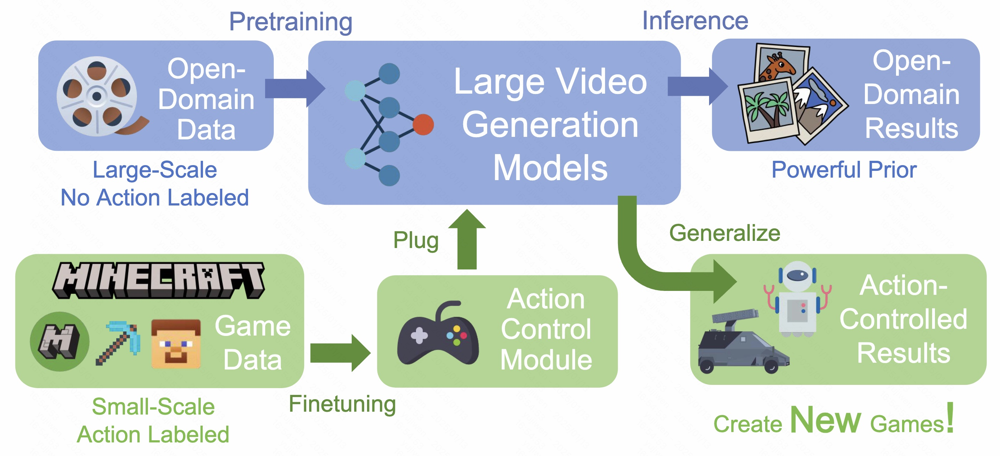
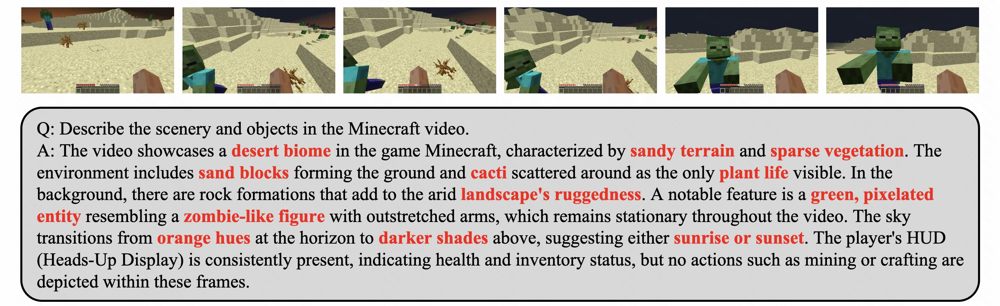

## ___***GameFactory: Creating New Games with Generative Interactive Videos***___
<div align="center">
</img>

 <a href='https://yujiwen.github.io/gamefactory/'></a> &nbsp;
 <a href='https://arxiv.org/abs/2501.08325'></a> &nbsp;
 <a href='https://huggingface.co/datasets/KwaiVGI/GameFactory-Dataset'></a> &nbsp;

**[Jiwen Yu<sup>1*&dagger;</sup>](https://yujiwen.github.io/), 
[Yiran Qin<sup>1*</sup>](https://github.com/IranQin), <br>
[Xintao Wang<sup>2&ddagger;</sup>](https://xinntao.github.io/), 
[Pengfei Wan<sup>2</sup>](https://scholar.google.com/citations?user=P6MraaYAAAAJ&hl=en),
[Di Zhang<sup>2</sup>](https://openreview.net/profile?id=~Di_ZHANG3),
[Xihui Liu<sup>1&ddagger;</sup>](https://xh-liu.github.io/)** 
<br>
<sup>1</sup>The University of Hong Kong
<sup>2</sup>Kuaishou Technology
<br>
&dagger;: Intern at KwaiVGI, Kuaishou Technology, *: Equal Contribution, &ddagger;: Corresponding Authors

</div>

## 📖 Introduction

<div align="center">
    
    <p><i>Schematic of our GameFactory creating new games based on pre-trained large video generation models.</i></p>
</div>


GameFactory is a novel framework designed to tackle the challenge of scene generalization in game video generation. Existing methods often struggle with fixed styles and environments, limiting their ability to create diverse and novel games. As shown in the schematic, GameFactory achieves this by combining the open-domain generative power of pre-trained large video generation models with an action control module learned from a small, high-quality dataset, [**GF-Minecraft**](https://huggingface.co/datasets/KwaiVGI/GameFactory-Dataset). This decoupling of game style learning and action control, implemented through a multi-phase training strategy, allows the framework to retain its open-domain generalization capabilities while enabling action-controllable video generation.

GameFactory also has the potential to serve as a **<span style="color:red;">generalizable world model</span>**, capable of generalizing actions within games and potentially extending to other domains, such as autonomous driving and embodied AI. While these broader applications remain an exciting avenue for future exploration, our framework lays the foundation for such possibilities by demonstrating strong generalization capabilities within the context of game development.

## 🔥 Release News
- `[2025/1/14]` Release [paper](https://arxiv.org/pdf/xxxx.xxxxx), [project page](https://vvictoryuki.github.io/gamefactory), [dataset](https://huggingface.co/datasets/KwaiVGI/GameFactory-Dataset).

## 🚀 GF-Minecraft Dataset
### 1. Dataset Introduction

The [**GF-Minecraft Dataset**](https://huggingface.co/datasets/KwaiVGI/GameFactory-Dataset) is designed to meet three key requirements for action-controllable video generation: 
1. **Customizable actions** for cost-effective, large-scale data collection.
2. **Unbiased action sequences** to ensure diverse and low-probability action combinations.
3. **Diverse scenes** with textual descriptions to capture scene-specific physical dynamics.

We use [**Minecraft**](https://minedojo.org/) as the data collection platform due to its comprehensive API, diverse open-world environment, and extensive action space. By executing predefined, randomized action sequences, we collected **70 hours of gameplay video** with action annotations.

To enhance diversity, we preconfigured three biomes (forest, plains, desert), three weather conditions (clear, rain, thunder), and six times of day (e.g., sunrise, noon, midnight), resulting in more than **2,000 video clips**. Each clip contains **2,000 frames** and is paired with textual descriptions generated by the multimodal language model [**MiniCPM-V**](https://github.com/OpenBMB/MiniCPM-V) (examples shown below). This dataset provides a strong foundation for training action-controllable and generalizable game video generation models.

<div align="center">
    
    <p><i>An example of video clip annotation, where words describing scenes and objects are highlighted in red and bolded.</i></p>
</div>


### 2. File Structure
The **GF-Minecraft Dataset** can be downloaded from [**HuggingFace**](https://huggingface.co/datasets/KwaiVGI/GameFactory-Dataset). Upon download, the dataset will be organized as follows:
```
GF-Minecraft
├── data_2003
│   ├── part_aa
│   ├── part_ab
│   ├── part_ac
│   ├── part_ad
│   ├── part_ae
│   └── part_af
└── data_269.zip
```
To prepare the dataset for use, navigate to the `data_2003` folder and merge the parts into a single zip file using the following command:
```bash
cat part_* > data_2003.zip
```
After extracting `data_2003.zip` and `data_269.zip`, the dataset will be organized as follows:
```
GF-Minecraft
├── data_2003
│   ├── annotation.csv
│   ├── metadata
│   │   ├── seed_1_part_1.json
│   │   ├── seed_2_part_2.json
│   │   ├── seed_3_part_3.json
│   │   └── ...
│   └── video
│       ├── seed_1_part_1.mp4
│       ├── seed_2_part_2.mp4
│       ├── seed_3_part_3.mp4
│       └── ...
└── data_269
    ├── annotation.csv
    ├── metadata
    │   ├── seed_1_part_1.json
    │   ├── seed_2_part_2.json
    │   ├── seed_3_part_3.json
    │   └── ...
    └── video
        ├── seed_1_part_1.mp4
        ├── seed_2_part_2.mp4
        ├── seed_3_part_3.mp4
        └── ...
```
We have also placed a file `sample-10.zip`([link](https://huggingface.co/datasets/KwaiVGI/GameFactory-Dataset/blob/main/GF-Minecraft/sample-10.zip)) in the `GF-Minecraft/` directory, which contains 5 video files and their corresponding metadata from both `data_2003/` and `data_269/` folders. This can be used for quick reference of the file format.

#### Directory Details

1. **`annotation.csv`**: A CSV file containing the textual descriptions for all video clips. Each row corresponds to a video clip and includes the following columns:
   - **Original video name**: The name of the original video from which the clip is extracted.
   - **Start frame index**: The starting frame of the clip within the original video.
   - **End frame index**: The ending frame of the clip within the original video.
   - **Prompt**: The textual description associated with the clip.

2. **`metadata/`**: A folder containing JSON files with detailed metadata for each video clip.

3. **`video/`**: A folder containing the video files in `.mp4` format. The filenames (e.g., `seed_1_part_1.mp4`) correspond to their associated metadata and annotation records.

#### Explanation of Dataset Parts

- **`data_2003/`**: Contains the first part of the dataset, including both mouse movement actions and keyboard actions.

- **`data_269/`**: Contains the second part of the dataset, similarly structured to `data_2003/`, but includes only keyboard actions.

### 3. JSON File Details

#### Example JSON:
```json
{
    "biome": "plains",
    "initial_weather": "rain",
    "start_time": "Sunset",
    "actions": {
        "0": {
            "ws": 2,
            "ad": 0,
            "scs": 3,
            "pitch": 0.0,
            "yaw": 0.0,
            "pitch_delta": 0.0,
            "yaw_delta": 0.0,
            "pos": [-228.5, 75.0, 246.4]
        },
        "1": {
            "ws": 2,
            "ad": 1,
            "scs": 3,
            "pitch": 0.0,
            "yaw": 0.0,
            "pitch_delta": 0.0,
            "yaw_delta": 0.0,
            "pos": [-228.43, 75.0, 246.3]
        }
    }
}
```

Each JSON file in the `metadata/` folder provides detailed metadata for a corresponding video clip. The **most important information in the JSON file is the `actions` field**, which describes the sequence of actions executed during the video. Below are the key details:

- **actions**: A dictionary indexed by timestamps (e.g., `"0"`, `"1"`, etc.) representing the sequence of actions. Each video contains **2,000 frames**, and the actions for frames `1` to `1,999` correspond to the information in entries `"1"` to `"1999"` in the `actions` dictionary. The information in the `"0"` entry can be ignored as it does not correspond to any frame in the video. Each action entry includes:
  - **`ws`**: Encodes forward (`1`), backward (`2`), or no movement (`0`) along the W/S axis.
  - **`ad`**: Encodes left (`1`), right (`2`), or no movement (`0`) along the A/D axis.
  - **`scs`**: **`scs`**: Represents special control states, including jumping (space key, `1`), sneaking (shift key, `2`), sprinting (ctrl key, `3`), or no action (`0`).
  - **`pitch`**: The vertical angle of the camera.
  - **`yaw`**: The horizontal angle of the camera.
  - **`pitch_delta`** and **`yaw_delta`**: Changes in pitch and yaw between consecutive frames. These values need to be multiplied by `15` to convert them into degrees.
  - **`pos`**: A 3D coordinate `[x, y, z]` representing the agent's position in the game world.

Other fields in the JSON file provide context for the actions:
- **biome**: Specifies the biome type where the video was recorded (`plains`, `forest`, or `desert`).
- **initial_weather**: Describes the weather condition at the start of the video (`clear`, `rain`, or `thunder`).
- **start_time**: Indicates the time of day at the start of the video (`"Starting of a day"`, `"Noon, sun is at its peak"`, `"Sunset"`, `"Beginning of night"`, `"Midnight, moon is at its peak"`, `"Beginning of sunrise"`).

### 4. Useful scripts
#### Invalid Jump and Collision Detection
The `detection.py` script processes all JSON files in the specified `metadata` directory to detect and mark collisions and invalid jumps. The updated JSON files are saved in a new `metadata-detection` directory.

Run the script with the following command:

```bash
python detection.py --dir_name Your_Directory_Root
```

Ensure the directory specified in `--dir_name` contains the following subdirectories:
- `video/`: Contains the video files.
- `metadata/`: Contains the JSON files to be processed.

#### Why Detect Invalid Jumps and Collisions?

**Invalid Jumps**: During data collection, the agent sometimes receives a jump action for several consecutive frames. However, once the agent is in the air, the jump action becomes ineffective—this is what we call an "invalid jump." By detecting and removing these invalid jump actions in the metadata, we simplify the learning process for the model by ensuring it only processes valid and meaningful actions.

**Collisions**: Collision detection provides additional information about the agent's interaction with the environment. Collisions, such as the agent hitting a wall or an obstacle, can be treated as a unique action signal. Incorporating this information into the metadata helps the model better understand environmental constraints and improves its ability to learn action dynamics. Of course, it is also possible to not provide this information and let the network learn it by itself.

#### Action Visualization

The provided script `visualize.py` allows users to annotate input videos with action information and save the output as an annotated video. Simply run the script directly to execute the visualization process:

```bash
python visualize.py
```

The script uses a predefined action format, where actions are described as a list of entries. Each entry includes:
- A frame range for which the action is active.
- A string encoding the specific action details.
- Optionally, a list of specific frames where the space key (jump) is pressed.

For example `[[25, "0 0 0 0 0 0 0 0 0.5"], [77, "1 0 0 0 0 0 0 0 0"], "15 30 50"]`:
- `[25, "0 0 0 0 0 0 0 0 0.5"]` indicates an action lasting until frame 25 with specific movement and control states.
- `[77, "1 0 0 0 0 0 0 0 0"]` specifies a new action starting from frame 26 and lasting until frame 77.
- `"15 30 50"` lists the frames where the space key (jump) is pressed, such as frames 15, 30, and 50.

The action string consists of `"w s a d shift ctrl collision delta_pitch delta_yaw"`


## 🌟 Citation
Please leave us a star 🌟 and cite our paper if you find our work helpful.
```
@misc{yu2025gamefactory,
      title={GameFactory: Creating New Games with Generative Interactive Videos}, 
      author={Yu, Jiwen and Qin, Yiran and Wang, Xintao and Wan, Pengfei and Zhang, Di and Liu, Xihui},
      year={2025},
      eprint={2501.08325},
      archivePrefix={arXiv},
}
```
